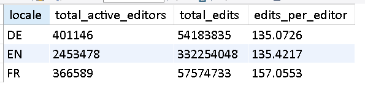
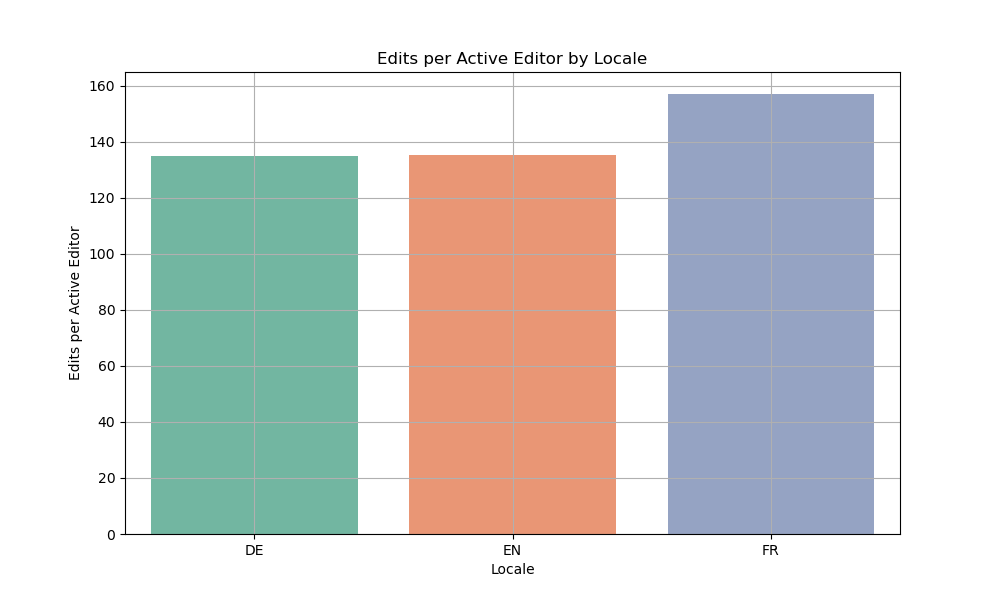
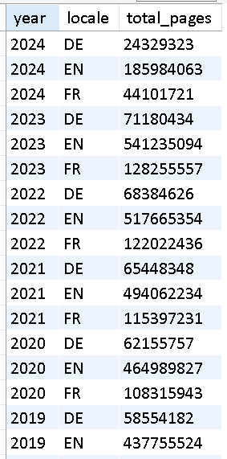
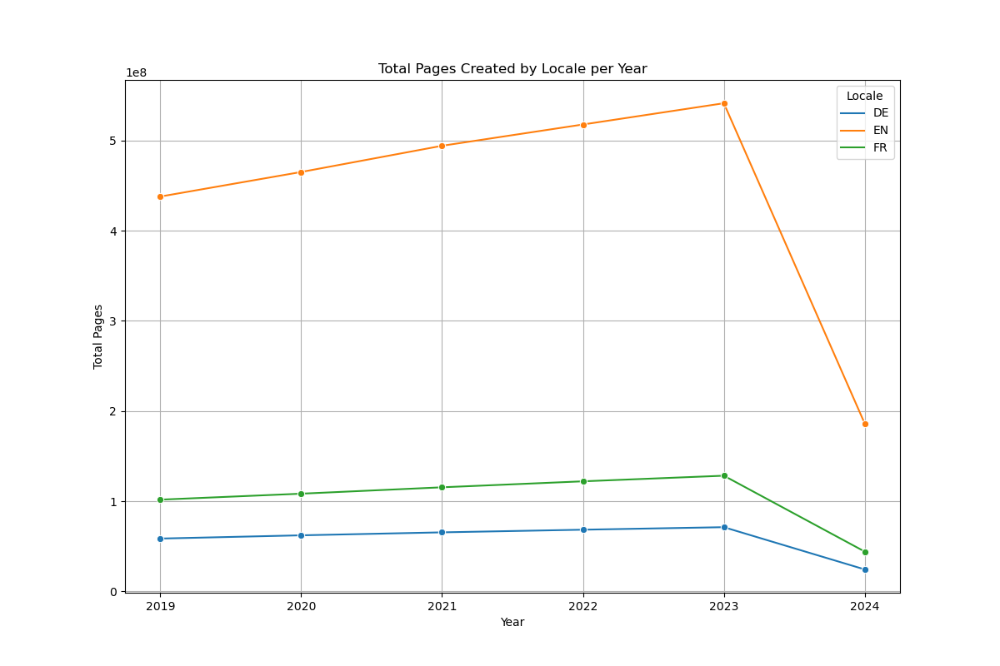
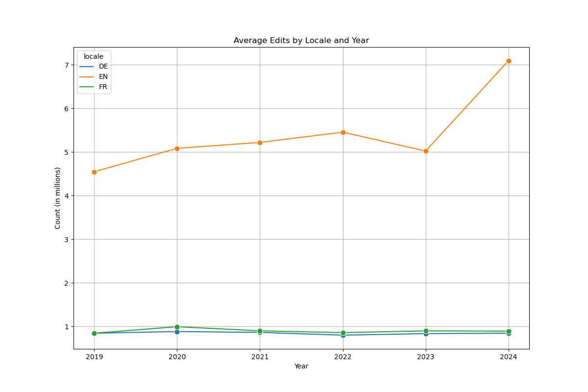
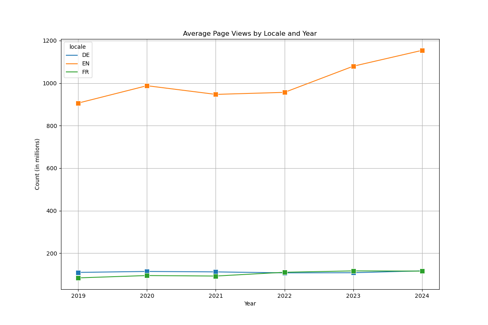

# ironhack-week-4-wikidata-sql
Collaboration between Jayashree &amp; Daniel on Week 4's challenge

## Scope
### Dataset: Wikimedia Statistics

### Business Framing:

**Overview:** Wikipedia is one of the world’s most visited websites and also the source for factual information for billions of people all over the world. While Wikipedia exists since twenty years, the user base is fluctuating constantly. Although one could think that Wikipedia is growing, which is the case for many of the world’s most spoken languages such as English, Spanish or French, the German language Wikipedia is actually shrinking throughout the past years. We want to investigate reasons for this anomaly. 

### What was analysed?:
1. User Engagement by Locale (yearly)
2. Impact of Active Editors on Edits
3. Growth in Total Pages
4. Impact of Edits on Page Views
5. Device Usage Patterns

Tl;Dr: What’s causing German Wikipedia to decrease in views YoY?  
**Hypothesis 1:** Hypothesis: There is a significant difference in the number of active editors per year between the DE, EN, and FR locales on Wikipedia. EN being the highest and FR being the lowest. 
 
 

**Hypothesis 2:** The number of edits per editor in FE is higher compared to DE and EN. 
 
 

**Hypothesis 3:** The number of total pages on Wikipedia has steadily increased over the years in each locale. 
 
 

**Hypothesis 4:** More number of edits equate to more number of average page views. When compared DE has 6 times less average edits than EN and 8 times less average page views than EN. 
 
 
 

**Hypothesis 5:** Overall users prefer mobile devices to use wikipedia compared to Desktops. 
 
 

### ERD Diagram

 **Project Planning:** Trello Board can be found [here](https://trello.com/b/NWCTnIAx/ironhack-week-4-jd) 

**NOTES:**

* Notebooks files can be found in `notebook` folder
* SQL files can be found in `sql` folder
* Image files can be found in `images` folder
* Slides can be found in `slides` folder